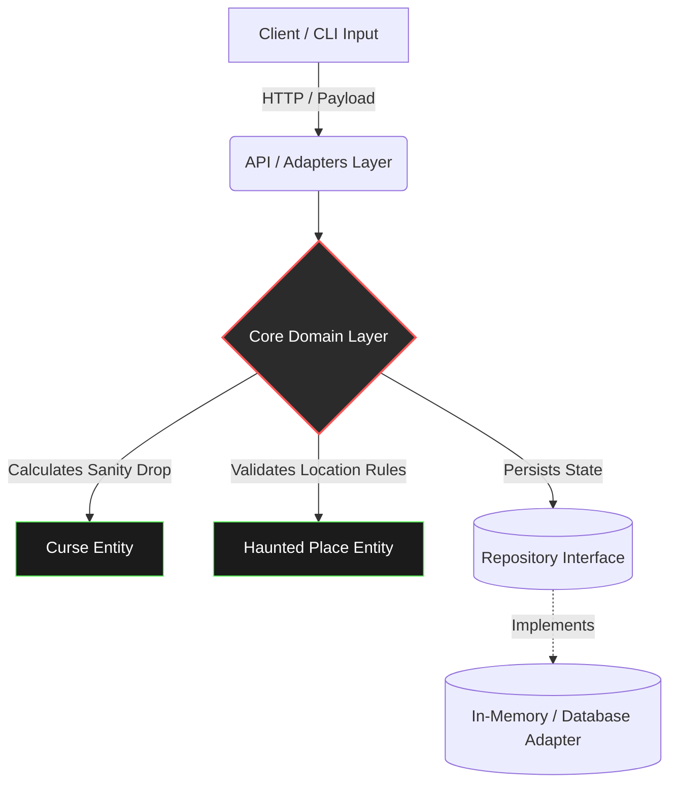

```mermaid
graph TD
    A[Client / CLI Input] -->|HTTP / Payload| B(API / Adapters Layer)
    B --> C{Core Domain Layer}
    C -->|Calculates Sanity Drop| D[Curse Entity]
    C -->|Validates Location Rules| E[Haunted Place Entity]
    C -->|Persists State| F[(Repository Interface)]
    F -.->|Implements| G[(In-Memory / Database Adapter)]
    
    style C fill:#2b2b2b,stroke:#ff5555,stroke-width:2px,color:#fff
    style D fill:#1b1b1b,stroke:#55ff55,stroke-width:1px,color:#fff
    style E fill:#1b1b1b,stroke:#55ff55,stroke-width:1px,color:#fff
```